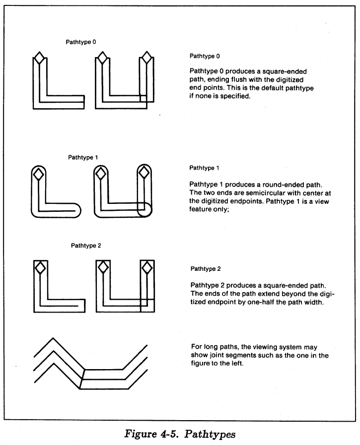

# GDSII 流文件格式手册

Release: 6.0

02.1987


Calma 公司 (Calma) 为本公司职员及客户准备了这个文档。 当本文档被Calma与客户之间的合同中引用时，Calma尊重本文档中的所有信息与承诺，且本文档中未包含的任何内容均不得用以解释更改合同。除上述用于合同目的外，或出于预定目的之外的任何目的，未经授权使用此文档信息。对于任何此类未经授权的使用，Calma或本文档的任何贡献者均不做任何关于本文档中信息的完整性，准确性或实用性的保证，也不暗示任何担保；对此类信息的使用不会侵犯私人权利，或由此类信息的使用可能会造成任何形式的损害不承担任何责任或义务。本出版物包含Calma的专有信息，仅供Calma人员和Calma客户使用。禁止出于任何目的，未经发行者明确的书面许可，全部或部分复制（包括扫描打印和/或计算机磁带/磁盘信息存储/检索系统）。本文档可能包含经版权所有者许可/许可复制的部分。

[TOC]


## 用户须知

流格式是GDSII数据的标准输出格式。它由OUTFORM和STREAMOUT写入并由INFORM读取的格式。 以这种格式保存的库可以轻易地转移到其他系统进行处理。 流格式在不同版本中向后兼容。 在旧版本下保存所谓库始终能被较新的版本读取。 因此，可以以流格式保存库并存档。

## 记录方式

流格式输出文件由可变长度的多条记录组成。 最小记录长度为4个字节（byte），无上限。 记录的前4个字节是**标头（Header）**。 **标头**的前两个字节（共16bit）则给出了总记录长度。 这个数字告诉了你这条记录将在哪里结束而下一条记录从哪里开始，下一条记录从这个数字所指向的字节之后立即开始。

**标头**的第三个字节是_记录类型（Record type）_。 **标头**的第四个字节描述记录中包含的_数据类型（Data type）_。 记录的第五个字节至最后一个字节是数据。 图2-1展示了一个典型的**标头**。


如果存储介质是磁带，则将以2048字节的物理块为单元输出流格式库。 记录可以跨越物理块边界，不需要完全被包含在单个物理块中。

空字符由两个连续的零字节组成。以下两种边界须使用空字符填充：

* 一个库的结尾或物理块的结尾处
* 多卷磁带中的最后一条记录及其物理块的结尾处

第3节与第4节分别描述流格式库的数据类型与记录类型，第5节展示了流格式库的语法结构。

## 数据类型

表3.1列出了可能的_数据类型_及其标识符。 你可以在每个记录的第四个字节中找到类型值。


下面详细描述表3.1中所提到的数据类型：

> 提醒：一个字节由16bit组成，计数范围从0到15，顺序从左到右。

 * 位数组（1）：

   位数组是使用特定位或一组位表示数据的一个字节。 位阵列允许一个字节代表许多简单的信息。

 * 2-byte带符号整型（2）：

   2-byte带符号整型采用一字节二进制的补码表示，范围由-32768到32767。下面是一个2-byte带符号整型的表示形式，S指代符号，M指代大小

   ​	`SMMMMMMM MMMMMMMM`

   下面是一些2-byte带符号整型的例子

   ​	`00000000 00000001 = 1`
   ​	`00000000 00000010 = 2`
   ​	`00000000 10001001 = 137`
   ​	`11111111 11111111 = -1`
   ​	`11111111 11111110 = -2`
   ​	`11111111 01110111 = -137`
	
 * 4-byte带符号整型（3）：

   4-byte带符号整型采用两字节二进制的补码表示，范围由-21,4748,3648到21,4748,3647。下面是一个4-byte带符号整型的表示形式，S指代符号，M指代大小

   ​	`SMMMMMMM MMMMMMMM MMMMMMMM MMMMMMMM`

   下面是一些4-byte带符号整型的例子

   ​	`00000000 00000000 00000000 00000001 = 1`
   ​	`00000000 00000000 00000000 00000010 = 2`
   ​	`00000000 00000000 00000000 10001001 = 137`
   ​	`11111111 11111111 11111111 11111111 = -1`
   ​	`11111111 11111111 11111111 11111110 = -2`
   ​	`11111111 11111111 11111111 01110111 = -137`

 * 4-byte实数型（4）和8-byte实数型（5）

   4-byte实数型采用两字节浮点数表示，8-byte实数型采用四字节浮点数表示。

   任意非零值：

	* 浮点数由三部分组成：符号，指数和尾数
	* 浮点数的值定义为：（尾数）x（将16提升为指数字段的真实值）
	* 指数字段（1-7bit位）采用Excess-64表示。 这7bit字段显示的数字比实际指数大64
	* 尾数部分始终为>=1/16且<1的正分数。 4字节实数尾数在8-31bit位， 8字节实数尾数在8-63bit位。
	* 二进制点位于第8bit位的左侧
	* 第8bit位表示值1/2，第9bit位表示1/4，依此类推。
	* 为了将尾数保持在1/16到1的范围内，对浮点算术的结果进行了归一化。 归一化是一个过程，其中尾数每次一次左移一位十六进制数字，直到其左四位表示一个非零数量。 对于每移位一个十六进制数字，指数将减少一。 由于尾数每次移位四位，因此标准化尾数的左三位可能为零。 零值（也称为真零）由所有位均为零的数字表示。

   在8-byte实数表示中，前四个字节与4-byte实数表示中的完全相同。 最后四个字节包含其他二进制位置，以实现更高的分辨率。
   4-byte实数型：

   ​	`SEEEEEEE MMMMMMMM MMMMMMMM MMMMMMMM`

   8-byte实数型：

   ​	`SEEEEEEE MMMMMMMM MMMMMMMM MMMMMMMM`
   ​	`MMMMMMMM MMMMMMMM MMMMMMMM MMMMMMMM`

   下面是一些4-byte实数型的例子

   > Note：在以下示例的前六行中，前7bit位指数字段=65。而实际指数为65-64 = 1。

   ​	`01000001 00010000 00000000 00000000 = 1`
   ​	`01000001 00100000 00000000 00000000 = 2`
   ​	`01000001 00110000 00000000 00000000 = 3`
   ​	`11000001 00010000 00000000 00000000 = -1`
   ​	`11000001 00100000 00000000 00000000 = -2`
   ​	`11000001 00110000 00000000 00000000 = -3`

   ​	`01000000 10000000 00000000 00000000 = .5`
   ​	`01000000 10011001 10011001 10011001 = .6`
   ​	`01000000 10110011 00110011 00110011 = .7`
   ​	`01000001 00011000 00000000 00000000 = 1.5`
   ​	`01000001 00011001 10011001 10011001 = 1.6`
   ​	`01000001 00011011 00110011 00110011 = 1.7`

   ​	`00000000 00000000 00000000 00000000 = 0`
   ​	`01000001 00010000 00000000 00000000 = 1`
   ​	`01000001 10100000 00000000 00000000 = 10`
   ​	`01000010 01100100 00000000 00000000 = 100`
   ​	`01000011 00111110 10000000 00000000 = 1000`
   ​	`01000100 00100111 00010000 00000000 = 10000`
   ​	`01000101 00011000 01101010 00000000 = 100000`

 * ASCII 字符串（6）

   ASCII字符的集合，其中每个字符都由一个字节表示。 所有奇数长度的字符串都必须填充一个空字符（数字零），并且包含ASCII字符串的记录的字节数必须包含此空字符。 流读程序必须寻找空字符，并且如果存在空字符，则将字符串的长度减少一。


## 记录类型

记录始终是偶数个字节长。 如果字符串的长度为奇数个字节，则将其填充为空字符。

以下是记录和每个记录的简要说明，其中括号中的前两个数字是记录类型，括号中的后两个数字是数据类型。 所有记录号均以十六进制表示。

```
0 HEADER                    2-byte带符号整型
[0002]                      包含两个字节的数据，代表版本号。 
                            表4-1列出了相应的版本号和GDSII发行版号。 
                            请注意，在版本6.0中，版本号更改为三位数。
```


```
1 BGNLIB                    2-byte带符号整型
[0102]                      包含库的最后修改时间以及上次访问的时间（年，月，日，小时，分钟和秒）。
                            并作为库的开始标记。
                            请参阅图4-1。
```


```
2 LIBNAME                   ASCII 字符串
[0206]                      包含一个字符串，它是库名。 
                            库名称必须遵守CDOS文件名约定，以获取长度和有效字符。 
                            库名称可能包含文件扩展名（大多数情况下为.DB）。
```

```
3 UNITS                     8-byte实数型
[0305]                      包含2个8字节实数。 
                            第一个是以用户为单位的数据库单元的大小。 
                            第二个是数据库单位（data base unit）的大小（以米为单位）。 
                            例如: 
                             如果您的库是使用默认单位（用户单位=1微米，每个用户单位1000个数据库单位）创建的，                              
                             则第一个数字为.001，第二个数字为lE-9。 
                            通常，第一个数字小于1，因为每个用户单位使用多个数据库单位。
```

```
4 ENDLIB                    No Data Present
[0400]                      作为库的终止标记。
```

```
5 BGNSTR                    2-byte带符号整型
[0502]                      包含结构的创建时间和最后修改时间（与BGNLIB记录的格式相同），并标记结构的开始。
```

```
6 STRNAME                   ASCII 字符串
[0606]                      包含一个字符串，它是结构名称。 结构名称最多可包含32个字符。
                            合法结构名称可以包含以下字符：
                             * [A-Z]
                             * [a-z]
                             * [0-9]
                             * 下划线 _
                             * 半角问号 ?
                             * 美元符号 $
```

```
7 ENDSTR                    2-byte带符号整型
[0700]                      包含结构的创建时间和最后修改时间（与BGNLIB记录的格式相同），并标记结构的开始。
```

```
8 BOUNDARY                  No Data Present
[0800]                      作为边界元素的起始标记。
```

```
9 PATH                      No Data Present
[0900]                      作为路径元素的起始标记。
```

```
10 SREF                     No Data Present
[0A00]                      作为SREF（Structure reference）元素的起始标记。
```

```
11 AREF                     No Data Present
[0B00]                      作为AREF（Array reference）元素的起始标记。
```

```
12 TEXT                     No Data Present
[0C00]                      作为文本元素的起始标记。
```

```
13 LAYER                    2-byte带符号整型
[0D02]                      包含两个字节，用于指定图层。 图层的值必须在O-63的范围内。
```

```
14 DATATYPE                 2-byte带符号整型
[0E02]                      包含两个字节，用于指定数据类型。 数据类型的值必须在O-63的范围内。
```

```
15 WIDTH                    4-byte带符号整型
[0F03]                      包含四个字节，这些字节以据库单位为单位指定路径或文本行的宽度。 
                            负值表示宽度是绝对的，即不受任何父参考的放大倍数的影响。 
                            如果省略，则假定为零。
```

```
16 XY                       4-byte带符号整型
[1003]                      包含以据库单位为单位的XY坐标数组。 
                            每个X或Y坐标长四个字节。
                            
                            路径和边界元素最多可具有200对坐标。 
                            路径必须具有至少2对坐标，边界必须具有至少4对坐标。 
                            边界的第一个点和最后一个点必须重合。
                            
                            文本或SREF元素必须只有一对坐标。
                            
                            AREF恰好具有三对坐标，它们指定了正交数组晶格。 
                            在AREF中，第一个点是数组参考点。 
                            第二点位于一个位置，该位置与参考点的距离为列间间距乘以列数。 
                            第三点定位的位置与参考点的距离为行间距乘以行数。
                            
                            一个node可能具有1到50对坐标。
                            
                            一个box必须具有五对坐标，且第一点和最后一点重合。
                            
                            有关array lattice的示例，请参见图4-2。
```


```
17 ENDEL                    No Data Present
[1100]                      作为元素的终止标记。
```

```
18 SNAME                    ASCII 字符串
[1206]                      包含引用结构的名称。 另请参阅STRNAME。
```

```
19 COLROW                   2-byte带符号整型
[1302]                      包含4个字节。 前2个字节包含数组中的列数。 
                            第三和第四字节包含行数。 
                            列数和行数都不得超过32,767（十进制），并且两者均为正数。
```

```
20 TEXTNODE                 No Data Present
[1400]                      标记文本节点的开头（当前未使用的）。
```

```
21 NODE                     No Data Present
[1500]                      作为节点开头的标记。
```

```
22 TEXTTYPE                 2-byte带符号整型
[1602]                      包含2个字节，表示文本类型。 文本类型的值必须在O-63的范围内。
```

```
23 PRESENTATION             2-byte带符号整型
[1701]                      包含1个字符（2个字节）的位标记符，用于表示文本。
                            第10和11位一起作为一个二进制数以指定字体
                            （00表示字体大小0，01表示字体大小1，10表示字体大小2，11表示字体大小3）。
                            第12和13位指定垂直对其（00表示顶部，01表示中间，而10表示底部）。 
                            位14和15指定水平对其（00表示左，01表示中心，而10表示右）。
                            O到9位保留供将来使用，必须清零。
                            如果省略此记录，则默认左上对齐和字体大小O。
                            图4-3展示了PRESENTATION record。
```


```
24 SPACING                  Discontinued
```

```
25 STRING                   ASCII 字符串
[1906]                      包含用于文本展示的字符串，最长512个字符。
```

```
26 STRANS                   位数组
[1A01]                      包含两个字节的针对“SREF，AREF和TEXT”的空间变换标识符。
                            0位（最左边的位）指定是否镜像。
                            如果设置镜像，则将在绕角旋转之前先以X轴为基准进行镜像。

                            对于AREF，则以整个阵列点阵为基准进行镜像，而不是针对每个阵列元素进行镜像。
                            
                            第13位标记绝对放大率。
                            第14位标记绝对角度。
                            第15位（最右边的位）和所有其余位保留供将来使用，必须将其清除。
                            如果省略此记录，则假定该元素没有镜像，并且假定其放大倍率和旋转角度均非绝对。
                            
                            图4-4展示了STRANS record.
```


```
27 MAG                      8-byte实数型
[1B05]                      包含一个双精度实数（8个字节），它是放大倍数。
                            如果省略，则默认放大倍数为1。
```

```
28 ANGLE                    8-byte实数型
[1C05]                      包含一个双精度实数（8个字节），它是角度旋转因子（单位：度），以逆时针方向为正。
                            对于AREF，“角度”将围绕阵列基准点旋转整个阵列网格
                            （各个阵列元素之间的相对位置不变）。 
                            如果省略此记录，则假定角度为零度。
```

```
29 UINTEGER                 User Integer(不再被使用)
                            用户整数数据仅在2.0版中使用。 如果以版本2.0读取任何流格式文件，
                            则流格式输入程序INFORM会将用户整数数据转换为属性号为126的属性数据。
                            另请参见PROPATTR和PROPVALUE。
```

```
30 USTRING                  User Integer(不再被使用)
                            用户字符串数据(以前称为字符串数据(CSD))曾在1.0和2.0版中被使用。 
                            如果将这些发行版中的任何流格式文件读入当前软件，
                            则流格式输入程序INFORM会将用户字符串数据转换为属性编号为127的属性数据。
                            如果该记录不存在，则为空字符串。 另请参见PROPATTR和PROPVALUE。
```

```
31 REFLIBS                  ASCII 字符串
[1F06]                      包含参考库的名称。 如果有任何引用库绑定到当前库，则该记录必须存在。
                            第一个参考库的名称从字节0开始，第二个库的名称从字节45（十进制）开始。 
                            参考库名称可能包括目录说明符（以“:”分隔）和扩展名（以“.”分隔）。 
                            如果未命名任何一个库，则其位置将填充为空。
```

```
32 FONTS                    ASCII 字符串
[2006]                      包含textfont定义文件的名称。
                            如果4种字体中的任何一种具有相应的textfont定义文件，则必须存在此记录。
                            如果所有字体都没有textfont定义文件，则该记录不能存在。
                            字体0的名称开始记录，然后是其余3种字体。
                            每个名称的长度为44个字节，如果没有相应的文本字体定义则为null。
                            如果每个名称短于44个字节，则用空值填充。
                            textfont定义文件名可能包含目录说明符
                            （以“:”分隔）和扩展名（以“.”分隔）。
```

```
33 PATHTYPE                 2-byte带符号整型
[2102]                      对于与端点齐平结束的方端路径，此记录值为0；
                            对于圆端路径，此记录值为1；
                            对于超出端点一半宽度的方端路径，此记录值为2。
                            路径类型4(仅适用于CustomPlus产品)表示具有可变方头扩展名的路径(参见记录48和49)。
                            如果未指定，则假定路径类型为0。 
                            路径类型如图4-5所示。
```



```
34 GENERATIONS              2-byte带符号整型
[2202]                      该记录包含要保留的已删除或备份结构的副本数的正数。 
                            此数字必须大于等于2且小于等于99。
                            如果不存在GENERATIONS记录，则默认值为3。
```

```
35 ATTRTABLE                ASCII 字符串
[2306]                      包含属性定义文件的名称。
                            仅当存在绑定到库的属性定义文件时，此记录才存在。
                            属性定义文件名可以包括目录说明符（用“:”分隔）和扩展名（用“.”分隔）。
                            最大大小为44个字节。
```

```
36 STYPTABLE                ASCII 字符串（新特性，暂未释出）
[2406]
```

```
37 STRTYPE                  2-byte带符号整型（新特性，暂未释出）
[2406]
```

```
38 ELFLAGS                  位数组
[2601]                      包含2个字节的位标志。
                            第15位（最右边的位）指定模板数据。
                            第14位指定外部数据（也称为外部数据）。
                            所有其他位当前未使用，必须清除为0。
                            如果省略此记录，则所有位均默认为0。
                            
                            有关模板数据的其他信息，请参阅《GDSII参考手册》。
                            有关外部数据的其他信息，请参阅《CustomPlus用户手册》。
                            图4-6展示了一个ELFLAGS记录。
```


```
39 ELKEY                    4-byte带符号整型（新特性，暂未释出）
[2703]
```

```
40 LINKTYPE                 4-byte带符号整型（新特性，暂未释出）
[28]
```

```
41 LINKKEYS                 4-byte带符号整型（新特性，暂未释出）
[29]
```

```
42 NODETYPE                 2-byte带符号整型
[2A02]                      包含2个字节，用于指定节点类型。
                            节点类型的值必须在0到63的范围内。
```

```
43 PROPATTR                 2-byte带符号整型
[2B02]                      包含2个字节，用于指定属性编号。
                            属性号是1到127之间的整数。
                            属性号126和127保留给版本3.0之前存在的用户整数和用户字符串（CSD）属性。 
                            (以前的版本中的用户字符串和用户整数数据通过流格式输入
                            程序INFORM转换为属性编号为127和126的属性数据。)
```

```
44 PROPVALUE                2-byte带符号整型
[2C06]                      包含与前面的PROPATTR记录中命名的属性关联的字符串值。
                            最大长度为126个字符。
                            与任何一个元素关联的属性值对必须全部具有不同的属性编号。
                            此外，对与任何一个元素相关联的属性数据的总量也有一个限制：
                            所有字符串的总长度加上属性值对的数量的两倍，不得超过128
                            （如果该元素为512，是SREF，AREF或节点）。
                            
                            例如，如果边界元素使用属性值为2的属性属性2和属性值为10的属性属性10，
                            则属性数据的总量将为18个字节。 
                            这是6个字节的“金属”(奇数长度的字符串必须用空值填充)
                            +8个“属性”+2倍于2个属性(4)=18。
```

```
45 BOX                      No Data Present
[2D00]                      作为Box元素的起始标记。
```

```
46 BOXTYPE                  2-byte带符号整型
[2E02]                      包含2个字节，用于指定boxtype。 
                            boxtype的值必须在0-63的范围内。
```

```
47 PLEX                     4-byte带符号整型
[2F03]                      该元素所属的plex下的所有元素共有的唯一正数（标识符）。 
                            通过设置第七位来标记plex的头部； 因此，plex数应足够小以仅占据最右边的24位。 
                            如果省略此记录，则该元素不是plex成员。
```

```
48 BGNEXTN                  Character String(不再被使用)
[3003]                      适用于PATH类型4。
                            包含四个字节，以数据库单位指定路径轮廓超出路径第一点的扩展。 值可以为负。
```

```
49 ENDEXTN                  4-byte带符号整型(此记录类型仅能在CustomPlus中存在。)
[3103]                      适用于PATH类型4。
                            包含四个字节，以数据库单位指定路径轮廓超出路径最后一点的扩展。 值可以为负。
```

```
50 TAPENUM                  2-byte带符号整型
[3202]                      包含两个字节，用于指定多卷流文件的当前卷带数。 
                            对于第一个磁带，TAPENUM为1； 对于第二个磁带，TAPENUM为2； 以此类推。
```

```
51 TAPECODE                 2-byte带符号整型
[3302]                      包含12个字节。 
                            对于多卷流文件的所有卷的标识符
                            （同一个流文件的标识符在多卷中相同）。 
                            它验证是否正在读取正确的卷轴。
```

```

```


## 语法结构

以下是流格式语法的巴科斯范式（Bachus-Naur Form）表示。 ALL CAPS中显示的元素是实际记录类型的名称。 用小写字母表示的元素意味着可以将名称进一步分解为一组实际的记录类型。 表5-1显示了所使用的不同符号的含义。

> <> 内包含必选项
> []内包含可选项（0次或1次）
> {}内包含选择项
> {}*内包含可重复0至无数次的项
> {}+内包含可重复1至无数次的项
> |表示在其左右两边任选一项
> ::是”被定义为“的意思，右边紧跟=


|                      |                                                              |
| -------------------- | ------------------------------------------------------------ |
| \<stream format\>::= | HEADER BGNLIB [LIBDIRSIZE] [SRFNAME] [LIBSECUR] <br />LIBNAME [REFLIBS] [FONTS] [ATTRTABLE] [GENERATIONS] [\<FormatType\>] <br />UNITS {\<structure\>}* ENDLIB |
| \<FormatType\>::=    | FORMAT I FORMAT {MASK}+ ENDMASKS                             |
| \<structure\>::=     | BGNSTR STRNAME [STRCLASS] {\<element\>}*<br/>ENDSTR          |
| \<element\>::=       | {\<boundary\> I \<path\> I \<SREF\> I \<AREF\><br/>I \<text\> I \<node\> I \<box\>} {\<property\>}*<br/>ENDEL |
| \<boundary\>::=      | BOUNDARY [ELFLAGS] [PLEX] LAYER DATATYPE XY                  |
| \<path\>::=          | PATH [ELFLAGS] [PLEX] LAYER DATATYPE<br/>[PATHTYPE] [WIDTH] [BGNEXTN] [ENDEXTN] XY |
| \<SREF\>::=          | SREF [ELFLAGS] [PLEX] SNAME [\<strans\>] XY                  |
| \<AREF\>::=          | AREF [ELFLAGS] [PLEX] SNAME [\<strans\>]<br/>COLROW XY       |
| \<text\>::=          | TEXT [ELFLAGS] [PLEX] LAYER \<textbody\>                     |
| \<node\>::=          | NODE [ELFLAGS] [PLEX] LAYER NODETYPE XY                      |
| \<box\>::=           | BOX [ELFLAGS] [PLEX] LAYER BOXTYPE XY                        |
| \<textbody\>::=      | TEXTTYPE [PRESENTATION] [PATHTYPE] [WIDTH]<br/>[\<strans\>] XY STRING |
| \<strans\>::=        | STRANS [MAG] [ANGLE]                                         |
| \<property\>::=      | PROPATTR PROPVALUE                                           |


## 多卷流格式


## 流格式文件示例